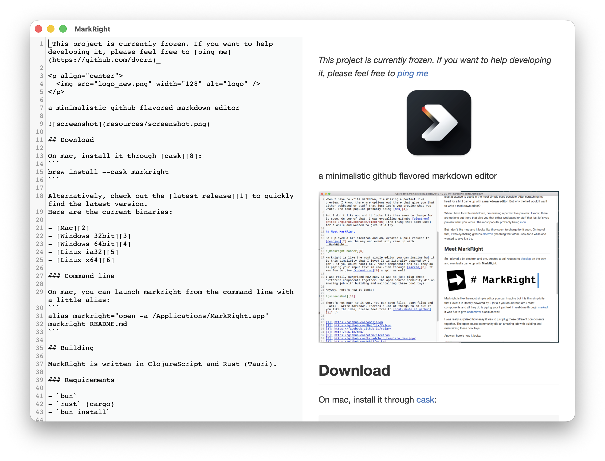

MarkRight - a minimalistic github flavored markdown editor



## Download

On mac, install it through [cask][8]:
```
brew install --cask markright
```

Alternatively, check out the [latest release][1] to quickly find the latest version. 
Here are the current binaries: 

- [Mac (DMG)][2]
- [Windows (Installer)][3]
- [Windows (MSI)][4]
- [Linux (Deb)][5]
- [Linux (AppImage)][6]

### Command line

On mac, you can launch markright from the command line with a little alias: 
```
alias markright="open -a /Applications/MarkRight.app"
markright README.md
```

## Building

MarkRight is written in ClojureScript and Rust (Tauri).

### Requirements

- `bun`
- `rust` (cargo)
- `bun install`

### Compiling
- `bun tauri build` compiles the frontend via `shadow-cljs` and the backend via `cargo`, producing a native binary.

### Development

- `bun run watch` runs `shadow-cljs watch main front` for live recompilation of the frontend.
- In another terminal, run `bun tauri dev` to launch the application.

## License

Licensed under [GPLv3][7]

[1]: https://github.com/dvcrn/markright/releases/latest/
[2]: https://github.com/dvcrn/markright/releases/download/1.0.0/MarkRight_1.0.0.dmg
[3]: https://github.com/dvcrn/markright/releases/download/1.0.0/MarkRight_1.0.0_x64-setup.exe
[4]: https://github.com/dvcrn/markright/releases/download/1.0.0/MarkRight_1.0.0_x64_en-US.msi
[5]: https://github.com/dvcrn/markright/releases/download/1.0.0/MarkRight_1.0.0_amd64.deb
[6]: https://github.com/dvcrn/markright/releases/download/1.0.0/MarkRight_1.0.0_amd64.AppImage
[7]: http://www.gnu.org/licenses/gpl-3.0.txt
[8]: http://caskroom.io/
